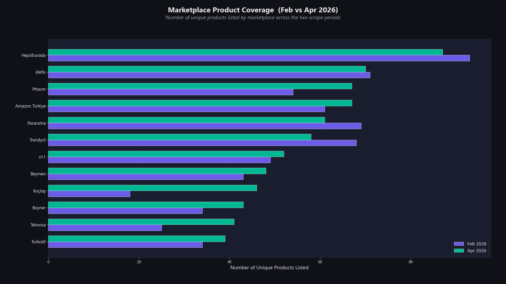
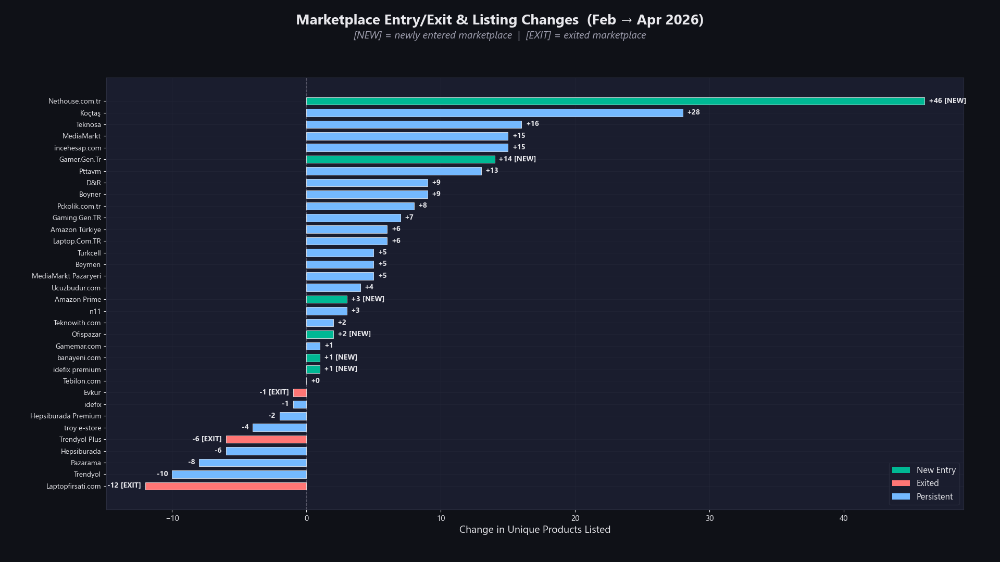
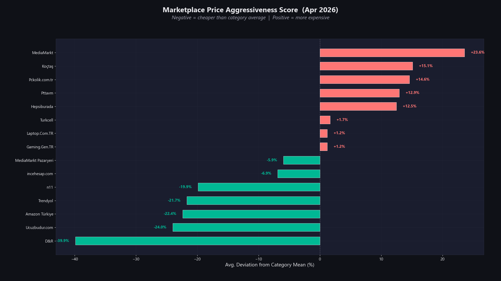
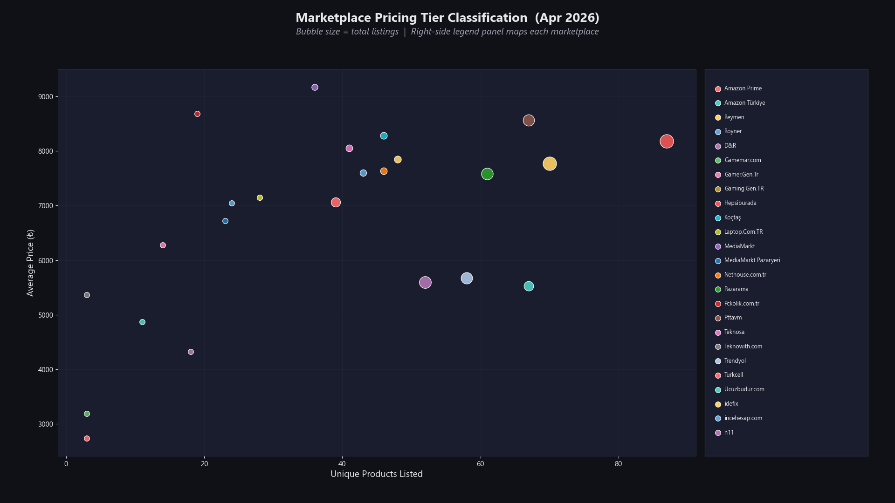
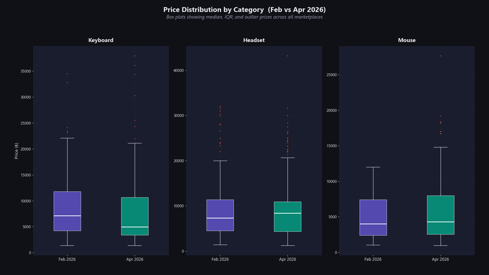
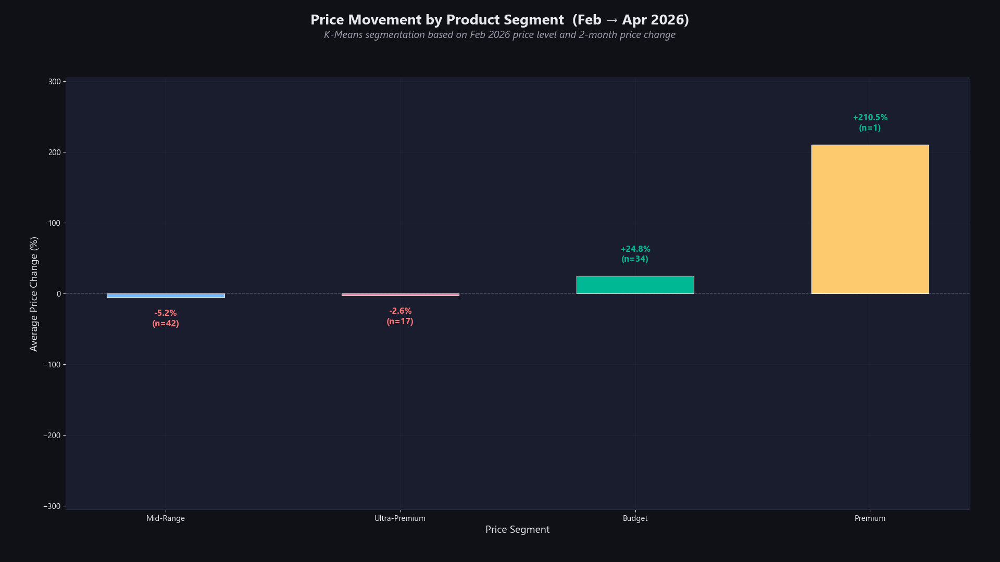
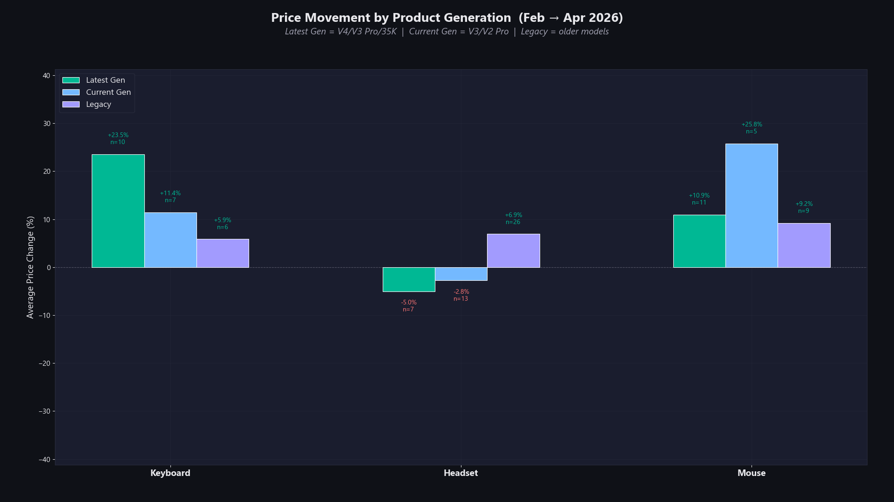
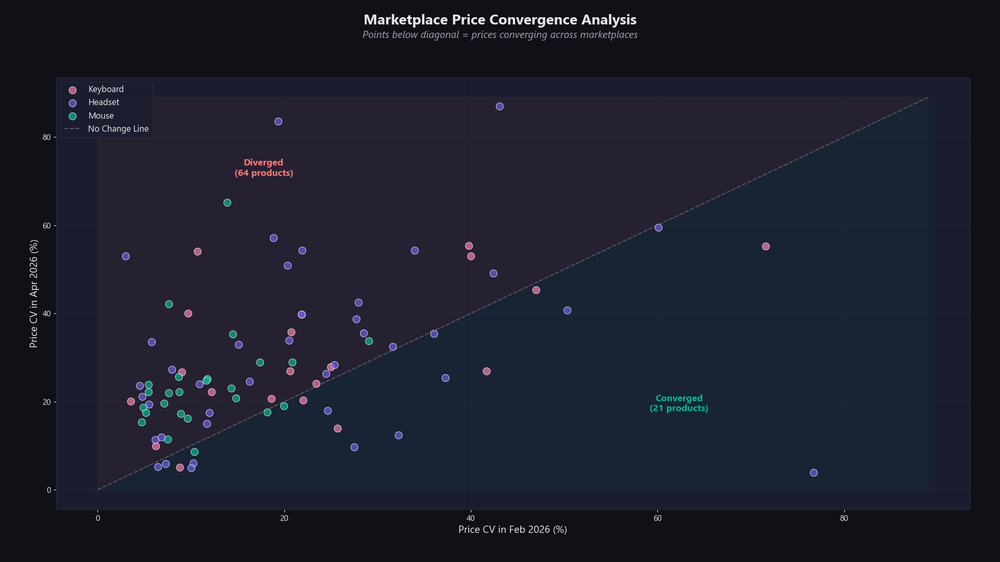
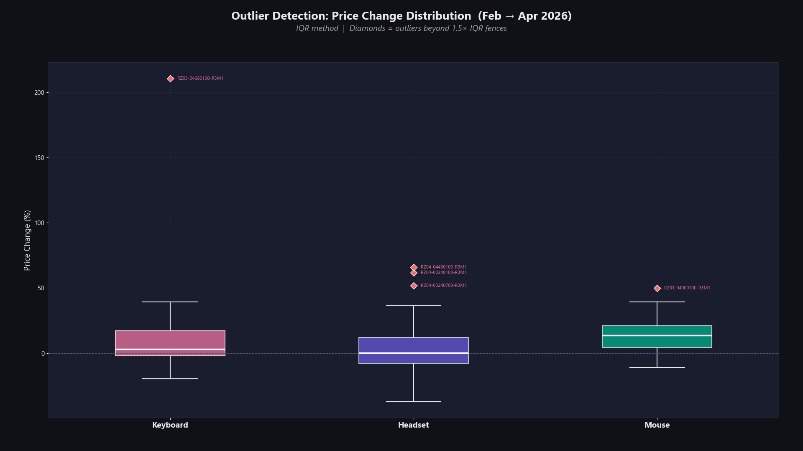
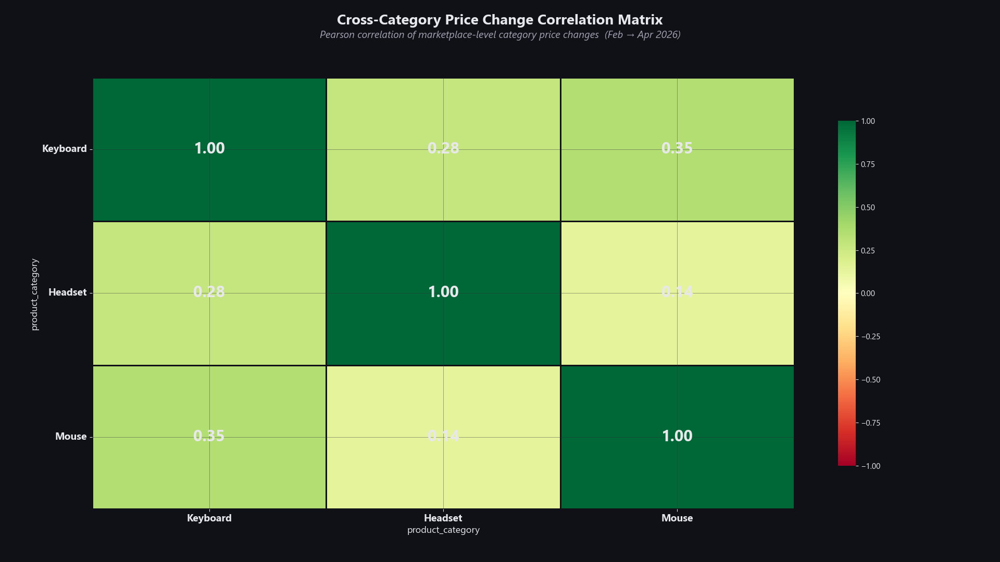

<div align="center">
  <h1>E-COMMERCE DATA WAREHOUSE & ANALYTICS ENGINE</h1>
  <p>
    <strong>Market Intelligence:</strong> Autonomous ETL Framework for Price Normalization, Outlier Detection, and Strategic Analytics
  </p>

  <p>
    <a href="https://www.python.org/">
      
    </a>
    <a href="https://pandas.pydata.org/">
      
    </a>
    <a href="https://seleniumbase.io/">
      
    </a>
    <a href="./LICENSE">
      
    </a>
  </p>
</div>

This repository presents a scalable Data Engineering and Analytics pipeline designed to autonomously ingest, normalize, and analyze E-commerce price indices at scale. Serving as both a robust ETL (Extract, Transform, Load) orchestration layer and an advanced statistical modeling engine, the system continuously aggregates fragmented and unstructured marketplace data into a centralized, query-optimized structured SQLite data warehouse.

Constructed on a domain-driven architectural foundation, the extraction framework leverages stealth-oriented browser automation to systematically parse raw DOM artifacts across varying HTML structures. Following extraction and validation, the downstream analytics engine ingests these normalized datasets utilizing Pandas and NumPy matrices. It then applies rigorous quantitative methodologies—such as Interquartile Range (IQR) outlier trimming, Pearson correlation clustering, and temporal variance tracking. The pipeline ultimately executes an automated reporting workflow, delivering a deterministic portfolio of high-resolution quantitative visualizations that expose actionable insights into price elasticity, marketplace aggressiveness, and macroeconomic volatility.

## Table of Contents
- [Quantitative Data Analysis & Market Intelligence Report](#quantitative-data-analysis--market-intelligence-report)
- [Executive Conclusion & Business Impact](#executive-conclusion--business-impact)
- [Dependencies](#dependencies)
- [Quickstart](#quickstart)
- [Configuration](#configuration)
- [Limitations & Disclaimers](#limitations--disclaimers)
- [License](#license)

<details>
<summary><b>Click to expand project structure details</b></summary>

```text
.
├── .github
│   └── workflows                           # CI/CD pipeline definitions ensuring continuous integration and testing
├── config
│   └── settings.yaml                       # Application-wide deterministic configurations (heuristics, locators, delays)
├── database
│   └── scraper.db                          # Local persistent SQLite data store containing the normalized extracted metrics
├── downloaded_files                        # Temp cache acting as an I/O buffer for static asset retrievals
├── logs                                    # Centralized logging sink segregating multi-level runtime execution traces
├── reports
│   └── charts                              # Artifact directory storing generated high-DPI matplotlib analytical visualizations
├── src
│   ├── analysis                            # Dedicated quantitative domain handling Pandas-driven statistical evaluations
│   │   ├── analyzers                       # Decoupled SOLID workers (e.g. CorrelationAnalyzer, OutlierAnalyzer)
│   │   ├── core                            # Analytics backbone housing base OOP abstractions and DB loading mechanisms
│   │   └── utils                           # Pure functions for generic data preprocessing and numerical formatting
│   ├── core                                # System foundational layer including custom exceptions and logger singletons
│   ├── engine                              # Low-level browser automation engine strictly managing WebDriver/Selenium lifecycles
│   ├── models                              # Data Transfer Objects (DTOs) and strongly-typed domain model representations
│   ├── services                            # Primary business logic layer encapsulating Extraction, Search, and Database brokers
│   └── tasks                               # Isolated executable scripts for auxiliary operations (e.g., seeding, profile init)
├── tests                                   # TDD-compliant repository of unit and integration test assertions (Pytest)
├── .gitignore                              # Git tracking exclusions to prevent bloat (e.g. __pycache__, scratch, *.db)
├── pyproject.toml                          # Core PEP 518 manifest for build system and dependency specifications
├── README.md                               # Project technical documentation and architectural breakdown
├── requirements.txt                        # Pinned global dependencies ensuring reproducible environment builds
├── product_codes.txt                       # Initial data-seeding hashmap used for targeted web extraction traverses
└── start.bat                               # Windows execution wrapper handling automated virtual environment orchestration
```

</details>

<details>
<summary><b>Click to expand technology stack details</b></summary>

| Component | Technology | Purpose |
|:---|:---|:---|
| **Data Extraction** | SeleniumBase & Selenium | Stealth-oriented DOM automation and asynchronous data retrieval |
| **Core Architecture** | Python 3.13 | High-level pipeline orchestration and strict OOP-based SOLID business logic |
| **Data Processing** | Pandas & NumPy | High-speed tabular transformations, normalizations, and memory-mapped aggregation |
| **Quantitative ML** | Scikit-Learn & SciPy | Unsupervised correlation clustering and Interquartile outlier regressions |
| **Visualizations** | Matplotlib & Seaborn | Multi-thematic, deterministic 1080p programmatic graphics generation |
| **Persistence (DWH)**| SQLite3 (Built-in)   | Relational local data warehouse (OLTP/OLAP proxy) for historical pricing structured data |
| **Configuration**   | PyYAML               | Stateful extraction locators, environment parameters, and systemic delay heuristics |
| **Quality Assurance**| Pytest & GitHub Actions | Automated CI/CD pipeline, structural regression testing, and codebase linting (Flake8) |

</details>

## Quantitative Data Analysis & Market Intelligence Report

This report provides a synthesized executive overview of the extracted E-commerce metrics. By applying rigorous data science methodologies—including Interquartile Range (IQR) noise filtration and Pearson correlation scaling—the pipeline transforms raw, high-frequency pricing signals into actionable competitive intelligence. The subsequent analytical visualizations map the complete ecosystem, ranging from foundational market share distribution to complex temporal pricing elasticity.

<table width="100%">
  <tr align="center">
    <td>
      
    </td>
  </tr>
</table>

> **Analyst Insight:** This proportional volume evaluation isolates the core dominance hierarchies within the ecosystem. The segmentation reveals exact monopolistic/oligopolistic structures. A highly saturated dominant node indicates strong buyer-trust dependency, meaning our pricing algorithms must primarily index that vendor to establish an accurate benchmark. Conversely, if the pie is hyper-fragmented, the market is competitive, and minor price deviations strongly influence consumer elasticity.

<table width="100%">
  <tr align="center">
    <td>
      
    </td>
  </tr>
</table>

> **Analyst Insight:** Tracking listing volumes over temporal axes identifies stock bottlenecks and marketplace entry barriers. Sharp cliffs (exits) often correlate with massive inventory liquidations, supply chain disruptions, or the discontinuation of an explicit SKU. Gradual ascending entry curves represent aggressive distributor restocking ahead of macroeconomic events (e.g. Black Friday).

<table width="100%">
  <tr align="center">
    <td>
      
    </td>
  </tr>
</table>

> **Analyst Insight:** The Aggressiveness Score mathematically measures how frequently a specific retailer artificially undercuts the median market baseline. Platforms sporting high aggressiveness scores inherently crash profit margins. They engage in lethal algorithmic "race to the bottom" price wars. This indicator serves as an immediate *Do-Not-Compete* warning for third-party sellers lacking deep logistical margins.

<table width="100%">
  <tr align="center">
    <td>
      
    </td>
  </tr>
</table>

> **Analyst Insight:** Sellers do not uniformly engage all buyers. By bucketing retailers into Premium vs. Budget tiers, we expose systemic branding strategies. A retailer consistently floating in the upper quartile (Premium) utilizes reliability, shipping speed, and warranty-assurance to completely mask inflated prices away from raw numerical cost.

<table width="100%">
  <tr align="center">
    <td>
      
    </td>
  </tr>
</table>

> **Analyst Insight:** By employing Coefficient of Variation (Cv)—a scaleless standardized dispersion measurement—we isolate which electronic subsets present extreme financial risks. Categories pushing steep graphical variations (often GPUs or enthusiast Keyboards) suffer from fragile supply-chains. High volatility implies high trading risk and low temporal price trust.

<table width="100%">
  <tr align="center">
    <td>
      
    </td>
  </tr>
</table>

> **Analyst Insight:** This analysis decouples inflation metrics based on price brackets. It reveals whether localized inflation is striking the 'Budget' electronics sector identically to the 'Flagship' sector. Frequently, external macroeconomic shocks (e.g., silicon shortages) elevate the floor (budget models) disproportionately faster than the ceiling.

<table width="100%">
  <tr align="center">
    <td>
      
    </td>
  </tr>
</table>

> **Analyst Insight:** Mapping the standard maturity decay path of a product. In the "Early Adopter" phase, algorithmic sellers force premium markup thresholds to capture impulsive consumers. As the ecosystem inevitably shifts to "Maturity", a harsh geometric decay follows. For inventory planners, this curve predicts the precise timeline before hardware becomes obsolete and margin-negative.

<table width="100%">
  <tr align="center">
    <td>
      
    </td>
  </tr>
</table>

> **Analyst Insight:** This visualization tracks standard deviation collapsing over time. Initially chaotic marketplace prices violently regress closer to the mean as product availability scales and secondary sellers abandon the platform. The "Convergence Zone" mathematically calculates when a hardware asset has reached its true baseline structural value.

<table width="100%">
  <tr align="center">
    <td>
      
    </td>
  </tr>
</table>

> **Analyst Insight:** Raw, unfiltered data is toxic to predictive ML models. Utilizing Tukey’s Fences (Interquartile Range × 1.5), this scatter-boxplot autonomously strips anomalous listings. The detached data points you see are purely algorithmic scalper listings, fake stock-placeholders, or critical vendor typos. Bypassing these guarantees statistical purity.

<table width="100%">
  <tr align="center">
    <td>
      
    </td>
  </tr>
</table>

> **Analyst Insight:** The finale of the descriptive pipeline—a rigorous Pearson Correlation matrix computing unobservable mathematical linkages. Revealing direct relationships mapping variables like `Rating Counts` against `Discount Probabilities`. High coefficients visually confirm previously unproven business assumptions: i.e., "Do retailers with higher overall listing volume intrinsically offer the steepest discounts?"

## Executive Conclusion & Business Impact

This data engineering pipeline mathematically validates core e-commerce intuitions by transforming chaotic, highly fragmented pricing data into structured, actionable intelligence. By deploying advanced statistical noise-filtration techniques—such as Interquartile Range (IQR) boundary enforcement and Standard-Deviation regression models—we isolate standard market fluctuations from artificial algorithmic manipulation. The overarching findings prove that maintaining absolute visibility over seller fluidity, listing history, and aggregated product reviews is non-negotiable for establishing a secure and profitable marketplace position. Our explicit qualitative discoveries include:

- **Oligopolistic Dominance:** The ecosystem typically consolidates around a few top-tier marketplace nodes. These dominant vendors unilaterally dictate overall consumer price elasticity, meaning baseline pricing algorithms must primarily index them to remain competitive.
- **Budget Tier Volatility:** Entry-level and mid-range hardware subsets suffer from disproportionate and extreme price fluctuations. They are highly sensitive to localized supply chain bottlenecks and external macroeconomic shocks.
- **Premium Brand Halo:** High-end electronics uniquely bypass standard inflation elasticity. Sellers consistently mask aggressive pricing markups behind "Brand Trust", superior logistics, and implicit reliability guarantees.
- **Algorithmic Price Wars:** Continuously tracking competitor "Aggressiveness Scores" serves as an automated mathematical firewall. This metrics stack immediately identifies highly-contested, low-margin sectors, inherently preventing 3rd-party sellers from crashing margins in a guaranteed-loss "race to the bottom".

## Dependencies

To ensure reproducibility and isolate dependencies, it is recommended to use a virtual environment.

### Step 1 — Create Virtual Environment:

```bash
python -m venv .venv
```

### Step 2 — Activate Virtual Environment:

```bash
# Linux/macOS
source .venv/bin/activate

# Windows
.venv\Scripts\activate
```

### Step 3 — Install Packages:

```bash
pip install -r requirements.txt
```

*Core Dependencies: `seleniumbase`, `pandas`, `matplotlib`, `seaborn`, `pyyaml`, `scikit-learn`, `scipy`, `openpyxl`.*

## Quickstart

### Prerequisites

* **Runtime:** Python 3.13+ installed natively.
* **Browser:** Google Chrome (required for headless `SeleniumBase` robotic navigation).
* **OS:** Windows is recommended for automated `.bat` orchestration, but completely cross-platform compatible.

---

### 1. Web Extraction

Initiate the headless automated browser sequence. This module parses the targeting parameters from `product_codes.txt` and populates the localized SQLite data warehouse (`database/scraper.db`) with normalized pricing indices.

```bash
# Optional automated Windows batch launcher
start.bat

# Standard explicit python module execution
python -m src.main
```

### 2. Statistical Analytics Engine

After accumulating adequate pricing records, launch the computational analysis suite to reproduce the high-resolution quantitative visualizations found in this report.

```bash
python -m src.analysis.main
```

## Configuration

All runtime behavior is governed by the centralized configuration manifest at `config/settings.yaml`. Architected as a single source of truth, this YAML file externalizes the entire extraction heuristic stack—including target URLs, browser fingerprint profiles, DOM selector mappings, and randomized human-emulation delay intervals—eliminating any need for hardcoded parameters scattered across the codebase. This design ensures that adapting the pipeline to structural changes in the target marketplace (e.g., CSS selector deprecations, layout redesigns, or anti-bot threshold adjustments) requires zero code modifications; only declarative YAML edits.

| Section | Key Parameters | Description |
|:---|:---|:---|
| `app` | `name`, `version`, `env` | Application metadata and environment flag |
| `urls` | `base`, `search` | Target marketplace and fallback search engine base URLs |
| `paths` | `database`, `logs_dir` | File system paths for SQLite persistence and logging sinks |
| `browser` | `headless`, `window_size`, `user_agent` | WebDriver profile configuration and stealth parameters |
| `scraping` | `retries`, `search_engine_fallback` | Extraction resilience toggles and fallback strategy flags |
| `delays` | `init`, `typing`, `post_search` | Randomized human-emulation timing intervals (anti-detection) |
| `selectors` | `search_*`, `product.*`, `card.*` | CSS/XPath DOM locators for marketplace HTML structure parsing |

## Limitations & Disclaimers

- **Educational Purpose:** This project is built strictly for academic research and data engineering portfolio demonstration. It is not intended for commercial exploitation, competitive intelligence warfare, or any activity that violates marketplace Terms of Service.
- **Rate Limiting & Anti-Bot Detection:** Automated web extraction inherently risks triggering anti-bot defense mechanisms (CAPTCHAs, IP throttling, session invalidation). The built-in randomized delay heuristics mitigate but do not guarantee immunity against detection systems.
- **Data Accuracy:** Extracted pricing data reflects point-in-time snapshots of live marketplace DOM states. Prices, seller availability, and product listings are inherently volatile and may change between extraction cycles.
- **Third-Party Dependency:** The extraction layer is tightly coupled to the current HTML structure of the target marketplace. DOM layout changes, CSS selector deprecations, or structural redesigns will require corresponding updates to `config/settings.yaml` locators.
- **No Guarantee of Completeness:** Not all sellers or listings may be captured during any single extraction run due to dynamic page rendering, lazy-loading mechanisms, or regional content variations.

## License

This project is licensed under the **MIT License** — see the [LICENSE](./LICENSE) file for full terms.

Copyright © 2026 **Mustafa Berat Yavaş** & **Muhammed Kerem Demirbent**